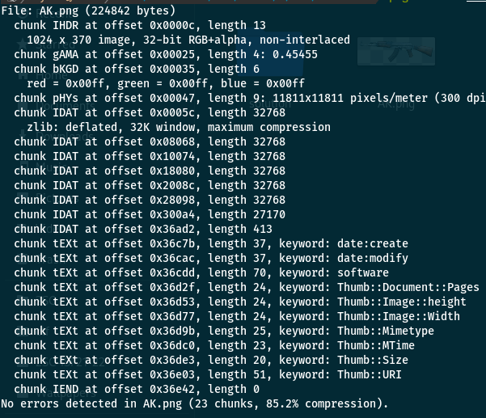

# Intruder

## Write-up

Since the picture is PNG the first thing we should run is the `pngcheck` command:



We notice that there is a suspicion in the last IDAT because of its length

So let try to extract it to decompress it

### IDAT structure

```bash
 01 9d       49 44 41 54      78 9c .............. 54 42 fe 0b 
| length | code ASCII 'IDAT'|         D A T A      |  CRC32  |
```

So we need to strip all thing that we don’t need `length` `"IDAT"` and `CRC32`

I write a simple py code to decompress:

```python
import zlib
import binascii
IDAT = "789cedd3416ac4301044d12b25ccfdef966dc074f1d53266acfed4c6d84aab9e32fafc7c8c31c618638c792ebf38d5faebfbff6ff25ff53aa89ba3e36b484fdebcd741dd341dd9bd5a5f4d5ed5ed9c803a75795fa2dee9a04eddeae46ac2931dd49da7e3bb57223233dfbb9d9eeaced39164e9fe33efa06e82ae97eb5ebc6d35e17ba2ee1b74d5af9affe6f9ddcc2e723eead4e56e9528af5f55e4535277b68e78c909e46ee4acc84a75737455b7bcbee7e20defba71eadeabdb999f5d577bf5f5dee6eaced0e57bb77a137b5f7378137527e98834ab7937f226efa26ea62ecfc9fd899df7cc52757374b943be653d1dd9f1ae7ba7ee8d3a2222cd799fd509f924d59daaabf6257d48dbbc57b592bc51374757f55f6d484e8364dfa2eebd3a323377abd6e4137be6bfa6eebdbade69e4ced5d76aceea69ab9ba0cbbf7fb24bb586fc55ef59dd1c1d5f737dae26f44eecfa959cb0bab375d5eeab22f26655dd8bba39ba6a427691e73cb9a756375357adcc73f29bdc4add4c1d3f01de8da87bbba89ba023e1cdf3b9552b57e7a83b5b678c31c61863cc46fe00a911ace7".decode('hex')
result = binascii.hexlify(zlib.decompress(IDAT))
print result
```

**Output:**

```txt
333033303330333033303330333033303330333033303330333033303330333033303330333033303330333033303330333033303330333033303330333033303330333033303330333033303330333033303330333033303330333033303330333033303330333033303330333033303330333033303330333033303330333033303330333033303330333033303330333033303330... # output truncated
```

We notice that this binary language `1` and `0`

So it will return like this:

```txt
000000000000000000000000000000000000000000000000000000000000000000000000000000000000000000000000000000000000000000000000000000000000000000000000000000000000000000000000000000000000000000000000000000000000000000000000000000000000000000000000000000000000000000000000000000000000000000000000000000000000000000000000000000000000000000000000000000000000000000000000000000000000000000000000000000000000000000000000000000000000000000000000000000000000000000000000000000000000000000000000000000000000000000000000000000000000000000000000000000000000000000000000000000000000000000000000000000000000000000000000000000000000000000000000000000000000000000000000000000000000000000000000000000000000000000000000000000000000000000000000000000000000000000000000000000000000000000000000000000000000000000000000000000000000000000000000000000000000000000000000000000000000000000000000000000000000000000000000000000000000000000000000000000000000000000000000000000000000000000000000000000000000000000000000000000000000000000000000000000000000000000000000000000000000000000000000000000000000000000000000000000000000000000000000000000000000000000000000000000000000000000000000000000000000000000000000000000000000000000000000000000000000000000000000000000000000000000000000000000000000000000000000000000000000000000000000000000000000000000000000000000000000000000000000111111111111111111111000111111111000111111000111000111111111000000111111111111111111111000000000000000000000000111111111111111111111000111111111000111111000111000111111111000000111111111111111111111000000000000000000000000111111111111111111111000111111111000111111000111000111111111000000111111111111111111111... # output truncated
```

If we look to the size which is `12321` and it is not divisible on `8` or `7` that’s mean we can’t convert it to text
but if we apply the square root we get `111` so it is like a picture with length 111

So I write a script to draw the image using `PIL` lib of python

```python
#!/usr/bin/env python
import Image
MAX = 25
pic = Image.new("RGB",(MAX, MAX))
str = "000000000000000000000000000000000000000000000000000000000000000000000000000000000000000000000000000000000000000000000000000000000000000000000000000000000000000000000000000000000000000000000000000000000000000000000000000000000000000000000000000000000000000000000000000000000000000000000000000000000000000000000000000000000000000000000000000000000000000000000000000000000000000000000000000000000000000000000000000000000000000000000000000000000000000000000000000000000000000000000000000000000000000000000000000000000000000000000000000000000000000000000000000000000000000000000000000000000000000000000000000000000000000000000000000000000000000000000000000000000000000000000000000000000000000000000000000000000000000000000000000000000000000000000000000000000000000000000000000000000000000000000000000000000000000000000000000000000000000000000000000000000000000000000000000000000000000000000000000000000000000000000000000000000000000000000000000000000000000000000000000000000000000000000000000000000000000000000000000000000000000000000000000000000000000000000000000000000000000000000000000000000000000000000000000000000000000000000000000000000000000000000000000000000000000000000000000000000000000000000000000000000000000000000000000000000000000000000000000000000000000000000000000000000000000000000000000000000000000000000000000000000000000000000000111111111111111111111000111111111000111111000111000111111111000000111111111111111111111000000000000000000000000111111111111111111111000111111111000111111000111000111111111000000111111111111111111111000000000000000000000000111111111111111111111000111111111000111111000111000111111111000000111111111111111111111000000000000000000000000111000000000000000111000111111111000000111000000111111111111111000111000000000000000111000000000000000000000000111000000000000000111000111111111000000111000000111111111111111000111000000000000000111000000000000000000000000111000000000000000111000111111111000000111000000111111111111111000111000000000000000111000000000000000000000000111000111111111000111000111000111111000000000111111111111111111000111000111111111000111000000000000000000000000111000111111111000111000111000111111000000000111111111111111111000111000111111111000111000000000000000000000000111000111111111000111000111000111111000000000111111111111111111000111000111111111000111000000000000000000000000111000111111111000111000111111000111000000111111000000000111000000111000111111111000111000000000000000000000000111000111111111000111000111111000111000000111111000000000111000000111000111111111000111000000000000000000000000111000111111111000111000111111000111000000111111000000000111000000111000111111111000111000000000000000000000000111000111111111000111000000000000000000111111111000000000000000000111000111111111000111000000000000000000000000111000111111111000111000000000000000000111111111000000000000000000111000111111111000111000000000000000000000000111000111111111000111000000000000000000111111111000000000000000000111000111111111000111000000000000000000000000111000000000000000111000111000000111111000111000000000000111000000111000000000000000111000000000000000000000000111000000000000000111000111000000111111000111000000000000111000000111000000000000000111000000000000000000000000111000000000000000111000111000000111111000111000000000000111000000111000000000000000111000000000000000000000000111111111111111111111000111000111000111000111000111000111000111000111111111111111111111000000000000000000000000111111111111111111111000111000111000111000111000111000111000111000111111111111111111111000000000000000000000000111111111111111111111000111000111000111000111000111000111000111000111111111111111111111000000000000000000000000000000000000000000000000000111000000111000111111111111111000111000000000000000000000000000000000000000000000000000000000000000000000000000111000000111000111111111111111000111000000000000000000000000000000000000000000000000000000000000000000000000000111000000111000111111111111111000111000000000000000000000000000000000000000000000000111111000000111111111000000000000111111000111000111000000111000000000111000111111111111000000000000000000000000111111000000111111111000000000000111111000111000111000000111000000000111000111111111111000000000000000000000000111111000000111111111000000000000111111000111000111000000111000000000111000111111111111000000000000000000000000111111000000000111000000111111111000111111000000111111000111000111111111111000111000111000000000000000000000000111111000000000111000000111111111000111111000000111111000111000111111111111000111000111000000000000000000000000111111000000000111000000111111111000111111000000111111000111000111111111111000111000111000000000000000000000000000000000111111000111111000000000111111111000111000000111000000111111000000111000000111000000000000000000000000000000000111111000111111000000000111111111000111000000111000000111111000000111000000111000000000000000000000000000000000111111000111111000000000111111111000111000000111000000111111000000111000000111000000000000000000000000111111111000000000000000111000111111111000111000000111111000000000000000000111000111000000000000000000000000000111111111000000000000000111000111111111000111000000111111000000000000000000111000111000000000000000000000000000111111111000000000000000111000111111111000111000000111111000000000000000000111000111000000000000000000000000000000000000000111000111000000000111111000111000111111111111000111111000000000000000000000000000000000000000000000000000000000111000111000000000111111000111000111111111111000111111000000000000000000000000000000000000000000000000000000000111000111000000000111111000111000111111111111000111111000000000000000000000000000000000000000000000111111111000000111000000000000000111000000000000111000000000000111111111111111111000111000000000000000000000000111111111000000111000000000000000111000000000000111000000000000111111111111111111000111000000000000000000000000111111111000000111000000000000000111000000000000111000000000000111111111111111111000111000000000000000000000000000000111111111000111000000111000111111111111111000111111000111111000111000000111000111000000000000000000000000000000111111111000111000000111000111111111111111000111111000111111000111000000111000111000000000000000000000000000000111111111000111000000111000111111111111111000111111000111111000111000000111000111000000000000000000000000000000000111000000000111111111111000000000111000111111000111000000000000000111000000111000000000000000000000000000000000111000000000111111111111000000000111000111111000111000000000000000111000000111000000000000000000000000000000000111000000000111111111111000000000111000111111000111000000000000000111000000111000000000000000000000000000111111000111000111000111111111000000000111000111111000111111111000111000111111000111000000000000000000000000000111111000111000111000111111111000000000111000111111000111111111000111000111111000111000000000000000000000000000111111000111000111000111111111000000000111000111111000111111111000111000111111000111000000000000000000000000111000111000111000000000111000111111111111000111000000000111000111111111111000111111111000000000000000000000000111000111000111000000000111000111111111111000111000000000111000111111111111000111111111000000000000000000000000111000111000111000000000111000111111111111000111000000000111000111111111111000111111111000000000000000000000000000000111000000000111000111111000111000111111111000000000000111111111000000111000000111000000000000000000000000000000111000000000111000111111000111000111111111000000000000111111111000000111000000111000000000000000000000000000000111000000000111000111111000111000111111111000000000000111111111000000111000000111000000000000000000000000000000000111111000000000000000111111111000111000111111000111111111111111111111000000000000000000000000000000000000000000111111000000000000000111111111000111000111111000111111111111111111111000000000000000000000000000000000000000000111111000000000000000111111111000111000111111000111111111111111111111000000000000000000000000000000000111111111000000000111000111111111000111000111000000111111000111111111111111000000000000000000000000000000000000111111111000000000111000111111111000111000111000000111111000111111111111111000000000000000000000000000000000000111111111000000000111000111111111000111000111000000111111000111111111111111000000000000000000000000000000000000000000000000000000000000111000111111000111000111111000000000111000000000111111111000000000000000000000000000000000000000000000000000000111000111111000111000111111000000000111000000000111111111000000000000000000000000000000000000000000000000000000111000111111000111000111111000000000111000000000111111111000000000000000000000000000000111111111111111111111000000000000111111000000111000000000000111000111000111000111000111000000000000000000000000111111111111111111111000000000000111111000000111000000000000111000111000111000111000111000000000000000000000000111111111111111111111000000000000111111000000111000000000000111000111000111000111000111000000000000000000000000111000000000000000111000111000111111000000000111111111111111111000000000111111000111111000000000000000000000000111000000000000000111000111000111111000000000111111111111111111000000000111111000111111000000000000000000000000111000000000000000111000111000111111000000000111111111111111111000000000111111000111111000000000000000000000000111000111111111000111000111111000000000111000000111000000111111111111111111000000000000000000000000000000000000111000111111111000111000111111000000000111000000111000000111111111111111111000000000000000000000000000000000000111000111111111000111000111111000000000111000000111000000111111111111111111000000000000000000000000000000000000111000111111111000111000000000000111111000000111000111000111000111000000000000111111111000000000000000000000000111000111111111000111000000000000111111000000111000111000111000111000000000000111111111000000000000000000000000111000111111111000111000000000000111111000000111000111000111000111000000000000111111111000000000000000000000000111000111111111000111000000000111111000111111111111000111111000111111000000111000111111000000000000000000000000111000111111111000111000000000111111000111111111111000111111000111111000000111000111111000000000000000000000000111000111111111000111000000000111111000111111111111000111111000111111000000111000111111000000000000000000000000111000000000000000111000111000111111000000111000000111111111111000000111000111000111111000000000000000000000000111000000000000000111000111000111111000000111000000111111111111000000111000111000111111000000000000000000000000111000000000000000111000111000111111000000111000000111111111111000000111000111000111111000000000000000000000000111111111111111111111000111000000111111111000111000000000111111000111111111111000111000000000000000000000000000111111111111111111111000111000000111111111000111000000000111111000111111111111000111000000000000000000000000000111111111111111111111000111000000111111111000111000000000111111000111111111111000111000000000000000000000000000000000000000000000000000000000000000000000000000000000000000000000000000000000000000000000000000000000000000000000000000000000000000000000000000000000000000000000000000000000000000000000000000000000000000000000000000000000000000000000000000000000000000000000000000000000000000000000000000000000000000000000000000000000000000000000000000000000000000000000000000000000000000000000000000000000000000000000000000000000000000000000000000000000000000000000000000000000000000000000000000000000000000000000000000000000000000000000000000000000000000000000000000000000000000000000000000000000000000000000000000000000000000000000000000000000000000000000000000000000000000000000000000000000000000000000000000000000000000000000000000000000000000000000000000000000000000000000000000000000000000000000000000000000000000000000000000000000000000000000000000000000000000000000000000000000000000000000000000000000000000000000000000000000000000000000000000000000000000000000000000000000000000000000000000000000000000000000000000000000000000000000000000000000000000000000000000000000000000000000000000000000000000000000000000000000000000000000000000000000000000000000000000000000000000000000000000000000000000000000000000000000000000000000000000000000000000000000000000000000000000000000000000000000000000000000000000000000000000000000000000"
i=0
for y in range (0,MAX):
    for x in range (0,MAX):
        if(str[i] == '1'):
            pic.putpixel([x,y],(0, 0, 0))
        else:
            pic.putpixel([x,y],(255,255,255))
        i = i+1
pic.show()
pic.save("flag.png")
```

After running the script we get a QRcode

Scan it and get the flag


