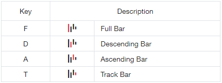
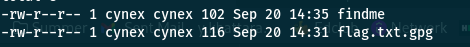

# POSTAL

## Write-up

To solve this challenge you need to analyze the jpg file in first step.

The image contain an Australian map and there are stanges rods on the bottom left corner.

But what represent these rods ?


After many searches we found that this image correspond to an *Australian Post 4-State Code*.

Now we "just" need to found a reader for this barcode...

When we search *Australian Post 4-State Code reader* we find a website named [bobcodes](http://bobcodes.weebly.com/auspost.html)

What's name of our dear friend ? "Bob", exactly. We are now on the good way.

So now, we need to convert the barcode in letters (T, D, A or H) to extract the infos. Here is the "rule" to convert :



After convert “code” : **ATDFFDDADDAADAADFAFAFFAFATAFAAATADTAFDTDDDDDDDTTTTTTTTADAFFFAFAAAAT**

Collect some infos :

```txt
62
78475110
K4N64r00zz
```

We can now analyze the first image with a steganography tool. To analyze an image in steganography

We test with the decode pic in the steghide command we find a zip called Treasure.zip with the password: **K4N64r00zz**

We excrate the zip file  but this file is locked with password…

I test it with all combination but no luck then I try to with the rockyou.txt wordlist

I find the password of zip by: **baltimore**

After we unzip it we find two file:



The content of findme:

```txt
nice you are close 
do you know gpg....?
I think you have the password just get back to your notes :)
```

So we need to find password to decrypt the flag

According to txt the password is in this list of our combinations

After little test we get the flag with this password: **78475110**

```bash
gpg -d flag.txt.gpg
# CyberErudites{4U57r4114_P057_4_57473}
```
